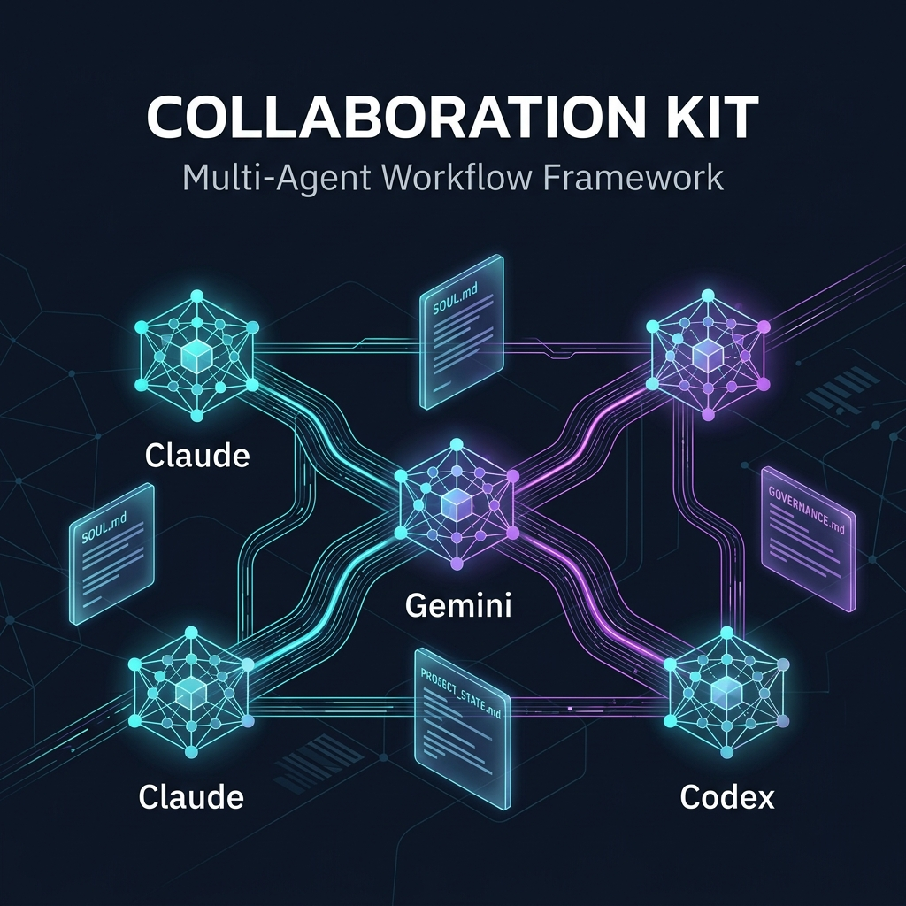
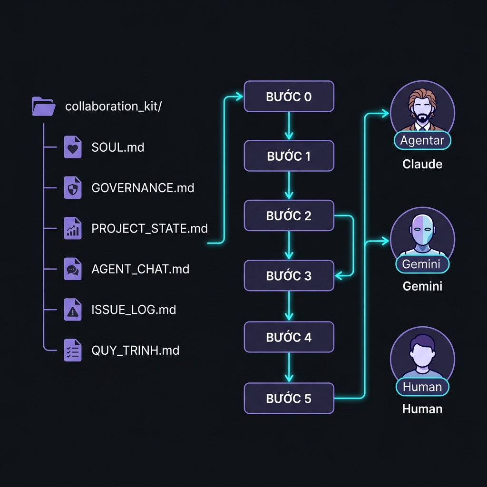

<div align="center">



# 🤖 Collaboration Kit

**Multi-Agent Workflow Framework cho AI Teams**

[](https://opensource.org/licenses/MIT)
[](https://github.com/yourusername/collaboration-kit)
[](http://makeapullrequest.com)
[](http://commonmark.org)
[](https://github.com/yourusername/collaboration-kit)

*Một bộ template chuẩn để nhiều AI agents làm việc cùng nhau — không conflict, không quên context, không overlap.*

[📖 Xem Tài Liệu](#-tài-liệu) · [🚀 Bắt Đầu Ngay](#-bắt-đầu-nhanh) · [💡 Ví Dụ](#-ví-dụ-thực-tế) · [🤝 Đóng Góp](#-đóng-góp)

</div>

---

## 🎯 Vấn Đề Cần Giải Quyết

Khi làm việc với nhiều AI agents trên cùng một project, bạn thường gặp:

| Vấn đề | Biểu hiện |
|--------|-----------|
| 🧠 **AI quên context** | Mỗi session mới = tờ giấy trắng, phải giải thích lại từ đầu |
| 💥 **Conflict giữa agents** | Agent A và B cùng sửa một file → overwrite nhau |
| 🔀 **Overlap công việc** | Hai agents làm cùng một task, lãng phí thời gian |
| 📭 **Không biết team đang làm gì** | Không có "single source of truth" về trạng thái project |
| 🔁 **Lặp lại lỗi cũ** | Không ai ghi nhớ lỗi đã gặp, cứ fix đi fix lại |

**Collaboration Kit giải quyết tất cả những điều này** bằng một hệ thống file markdown đơn giản.

---

## ✨ Giải Pháp

> **Ý tưởng cốt lõi:** Dùng **plain Markdown files** như một "bộ nhớ chung" chia sẻ giữa các agents — không cần database, không cần server, không cần tool đặc biệt. Chỉ cần Git.

```
Mỗi agent, mỗi session → ĐỌC context files → LÀM VIỆC → CẬP NHẬT trạng thái
```

---

## 📂 Cấu Trúc

```
collaboration_kit/
│
├── 📄 README.md                ← Bạn đang đọc file này
│
├── 🧬 SOUL.md                  ← Linh hồn project: Là gì? Làm gì? Cho ai?
├── ⚖️  GOVERNANCE.md            ← Luật chơi: Ai làm gì, giới hạn, approval
├── 📊 PROJECT_STATE.md         ← Trạng thái: Ai đang làm task gì?
├── 💬 AGENT_CHAT.md            ← Kênh chat: Giao việc, hỏi help, báo done
├── 🐛 ISSUE_LOG.md             ← Nhật ký lỗi: Tránh lặp lại lỗi cũ
├── 📋 QUY_TRINH.md             ← Quy trình 6 bước chuẩn
│
└── 📁 docs/                    ← Ảnh minh họa
    ├── banner.png
    └── workflow.png
```

---

## 🚀 Bắt Đầu Nhanh

### Bước 1: Clone hoặc Copy

```bash
# Clone repo
git clone https://github.com/yourusername/collaboration-kit.git

# Hoặc copy vào project hiện tại
cp -r collaboration-kit/ ./your-project/.agent/
```

### Bước 2: Điền Thông Tin

Mở và điền thông tin vào 2 file cốt lõi:

**`SOUL.md`** — Định nghĩa project:
```markdown
| **Project Name** | My Awesome App        |
| **Type**         | Web App               |
| **Description**  | App quản lý công việc |
| **Tech Stack**   | React, Firebase, Node |
```

**`PROJECT_STATE.md`** — Thêm thành viên:
```markdown
| **Claude**  | Bug fixes, Logic | 🟡 Active    |
| **Gemini**  | UI/UX, Design    | ⚪ Available |
| **Human**   | Approve, Review  | 👤 Available |
```

### Bước 3: Bắt Đầu Làm Việc

Mỗi khi bắt đầu một session mới với AI, **copy-paste prompt này**:

```
Hãy đọc các file sau trước khi làm việc:
1. SOUL.md - Hiểu project là gì
2. PROJECT_STATE.md - Xem ai đang làm gì
3. AGENT_CHAT.md - Xem có task mới không
4. ISSUE_LOG.md - Học từ lỗi cũ

Sau khi đọc xong, tóm tắt tình trạng project và hỏi tôi cần làm gì tiếp theo.
```

---

## 🔄 Workflow: 6 Bước Chuẩn



```
┌─────────────────────────────────────────────────────────────────┐
│  BƯỚC 0: KHỞI ĐỘNG  (2-3 phút)  ← Mỗi phiên mới PHẢI làm     │
│  □ Đọc PROJECT_STATE.md                                          │
│  □ Đọc AGENT_CHAT.md                                            │
│  □ Đọc ISSUE_LOG.md                                             │
├─────────────────────────────────────────────────────────────────┤
│  BƯỚC 1: NHẬN TASK   (5 phút)                                  │
│  □ Self-assign hoặc nhận assign từ agent khác                  │
├─────────────────────────────────────────────────────────────────┤
│  BƯỚC 2: CHUẨN BỊ   (10 phút)                                 │
│  □ Xác định files cần sửa                                       │
│  □ Kiểm tra GOVERNANCE.md — có được phép không?                │
│  □ Backup nếu là production                                     │
├─────────────────────────────────────────────────────────────────┤
│  BƯỚC 3: THỰC HIỆN  (tùy task)                                │
│  □ Code → Test → Deploy                                         │
├─────────────────────────────────────────────────────────────────┤
│  BƯỚC 4: CẬP NHẬT   (5 phút)                                  │
│  □ Cập nhật PROJECT_STATE.md                                    │
│  □ Ghi vào AGENT_CHAT.md                                        │
│  □ Git commit                                                   │
├─────────────────────────────────────────────────────────────────┤
│  BƯỚC 5: REVIEW     (10 phút — nếu cần)                       │
│  □ Gửi review → Fix feedback → ✅ DONE                         │
└─────────────────────────────────────────────────────────────────┘
```

---

## 👥 Hệ Thống Phân Quyền

`GOVERNANCE.md` định nghĩa rõ ràng ai được làm gì:

| Agent | Vai trò | Được phép sửa | KHÔNG được sửa |
|-------|---------|---------------|----------------|
| **Claude** | Bug fixes, Logic, Backend | `*.js`, `*.py`, `*.md` | `style.css`, `index.html` |
| **Gemini** | UI/UX, Design | `style.css`, `index.html` | `*.js`, `*.py` |
| **Codex** | Review, Optimization | Tất cả `*.js` | `style.css`, `index.html` |
| **Human** | Review, Approve | **Tất cả** | — |

> **Khi cần sửa file ngoài quyền hạn:** Xin phép trong `AGENT_CHAT.md` → chờ đồng ý → mới làm.

---

## 💬 Commands Nhanh

### Giao task (`@assign`)
```markdown
### 10:00 - Claude

**@assign → Gemini**

**Task:** Cập nhật màu nút bấm theo design mới
**Files:** style.css (button section)
**Test:** Mở browser, kiểm tra màu sắc
```

### Xin help (`@help`)
```markdown
### 14:30 - Gemini

**@help → Claude**

**Vấn đề:** Modal không hiển thị đúng z-index
**File:** style.css
**Đã thử:** Tăng z-index lên 9999, vẫn bị che
**Cần:** Review logic CSS
```

### Báo hoàn thành (`@done`)
```markdown
### 16:00 - Claude

**@done**

✅ Fix bug login redirect — user giờ được redirect về /dashboard
**Files đã sửa:** script.js (line 45)
**Đã test:** 3 test cases đều pass
```

---

## 💡 Ví Dụ Thực Tế

### Scenario: Dự án Web App với Claude + Gemini

**Ngày 1 — Setup:**
1. Human copy `collaboration_kit/` vào project
2. Điền thông tin vào `SOUL.md` và `PROJECT_STATE.md`
3. Giao task đầu tiên trong `AGENT_CHAT.md`

**Ngày 2 — Claude bắt đầu phiên mới:**
```
Claude đọc PROJECT_STATE.md → thấy task "Fix login bug"
Claude đọc AGENT_CHAT.md → thấy @assign từ Human
Claude đọc ISSUE_LOG.md → biết lỗi cũ về redirect
→ Claude fix, test, commit, cập nhật trạng thái
```

**Ngày 3 — Gemini vào làm UI:**
```
Gemini đọc context → thấy login đã fix
Gemini nhận task UI từ AGENT_CHAT.md
→ Không conflict với Claude vì roles tách biệt
```

---

## 📊 So Sánh: Có vs Không có Collaboration Kit

| | ❌ Không dùng | ✅ Dùng Collaboration Kit |
|--|--------------|---------------------------|
| Context | Giải thích lại mỗi session | Agents tự đọc files |
| Coordination | Dễ conflict, overlap | Phân quyền rõ ràng |
| Lỗi cũ | Lặp lại mãi | Ghi ISSUE_LOG, học từ lỗi |
| Trạng thái | Ai cũng hỏi "đang ở đâu?" | PROJECT_STATE luôn cập nhật |
| Onboarding | Mất thời gian explain | Đọc SOUL.md là hiểu ngay |

---

## 🗺️ Roadmap

- [x] v1.0 — Bộ kit cơ bản (6 files markdown)
- [ ] v1.1 — Task Envelope format (JSON structured tasks)
- [ ] v1.2 — Lock mechanism cho production files
- [ ] v1.3 — Parallel task distribution template
- [ ] v2.0 — CLI tool: `collab-kit init`, `collab-kit status`
- [ ] v2.1 — GitHub Actions integration

---

## 🤝 Đóng Góp

Mọi đóng góp đều được chào đón!

```bash
# 1. Fork repo
# 2. Tạo branch
git checkout -b feature/your-idea

# 3. Commit
git commit -m "feat: add your amazing feature"

# 4. Push và tạo Pull Request
git push origin feature/your-idea
```

**Cách đóng góp:**
- 🐛 **Báo lỗi** — Mở Issue với tag `bug`
- 💡 **Đề xuất** — Mở Issue với tag `enhancement`
- 📖 **Cải thiện tài liệu** — PR trực tiếp
- 🌍 **Dịch sang ngôn ngữ khác** — Rất được chào đón!

---

## 📁 Tài Liệu Chi Tiết

| File | Mô tả |
|------|-------|
| [SOUL.md](./SOUL.md) | Template định nghĩa identity của project |
| [GOVERNANCE.md](./GOVERNANCE.md) | Quy tắc, phân quyền, emergency protocol |
| [PROJECT_STATE.md](./PROJECT_STATE.md) | Template theo dõi trạng thái và tasks |
| [AGENT_CHAT.md](./AGENT_CHAT.md) | Kênh giao tiếp giữa các agents |
| [ISSUE_LOG.md](./ISSUE_LOG.md) | Nhật ký lỗi có cấu trúc |
| [QUY_TRINH.md](./QUY_TRINH.md) | Quy trình 6 bước đầy đủ với ví dụ |
| [PROJECT_SETUP_CHECKLIST.md](./PROJECT_SETUP_CHECKLIST.md) | Checklist setup project mới |

---

## 📜 License

MIT License — Tự do sử dụng, chỉnh sửa, và phân phối.

---

## 🌟 Nếu thấy hữu ích...

⭐ **Star repo này** để giúp nhiều người biết đến hơn!

---

<div align="center">

**Collaboration Kit** — *Vì AI agents cũng cần teamwork*

Made with ❤️ | [⬆️ Lên đầu trang](#-collaboration-kit)

</div>
